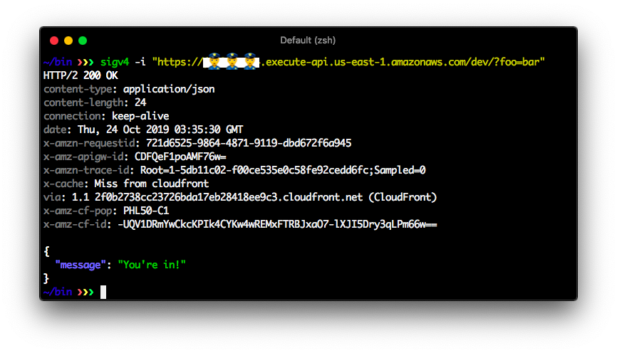

<h1 align="center">
  sigv4
</h1>

<p align="center">
   An AWS SigV4 service cli
</p>

<div align="center">
  
</div>

<div align="center">
  <a href="https://github.com/softprops/sigv4/actions">
    
  </a>
</div>

<br/>

## 🍬 features

* familiar interface
* colors
* pretty printed application/json responses

## 📦 install

### Via GitHub Releases

Prebuilt binaries for osx and linux and windows are available for download directly from [GitHub Releases](https://github.com/softprops/sigv4/releases)

```sh
$ curl -L \
 "https://github.com/softprops/sigv4/releases/download/v0.0.0/sigv4-$(uname -s)-$(uname -m).tar.gz" \
  | tar -xz
```

## 🤸 usage

If you know curl, you'll be right at home with with sigv4. It's interface was designed to be familiar to those that are
all ready familiar with interacting with http services from the command line

```sh
sigv4 0.1.0
sign aws sigv4 requests like a pro

USAGE:
    sigv4 [FLAGS] [OPTIONS] <uri>

FLAGS:
    -h, --help       Prints help information
    -i, --include    Include HTTP headers in output
    -V, --version    Prints version information

OPTIONS:
    -d, --data <data>            Optional request body to send with the request
    -H, --header <headers>...    Optional headers to include with the request
    -X, --request <method>       HTTP method [default: GET]
    -r, --region <region>        AWS Region your resource is hosted in [default: us-east-1]
    -s, --service <service>      AWS service name [default: execute-api]

ARGS:
    <uri>    Remote resource URI
```

## 📓 resources

### 🗺️ lambda setup

Let's say you're a company with a serverless strategy. You'll likely want to expose some private AWS Lambdas behind API GateWay and would like to limit access to your organization's internal use. The following outlines how you might go about doing that.

First you'll need to identify your [AWS organiztaion](https://aws.amazon.com/organizations/) **id**. You can get this from the [Organizations console](https://console.aws.amazon.com/organizations/home) or the command line with the `aws` cli.

```sh
$ aws organizations \
  describe-organization \
  --query 'Organization.Id' \
  --output text
```

Secondly, you'll need to configure your API Gateway to **only allow access to that organization**.

With Serverless Framework, you can do this declaratively as part of your deployment by [declaring a `resourcePolicy`](https://serverless.com/framework/docs/providers/aws/events/apigateway/#http-endpoints-with-aws_iam-authorizers) that limits access to your AWS Organization Id and [declare an `aws_iam` authorizer](https://serverless.com/framework/docs/providers/aws/events/apigateway/#http-endpoints-with-aws_iam-authorizers) for your private functions in your serverless.yml file.

```diff
service: SECRET_SAUCE

provider:
  name: aws
  runtime: YOUR_DEFAULT_FUNCTION_RUNTIME
+  resourcePolicy:
+    - Effect: Allow
+      Principal: '*'
+      Action: execute-api:Invoke
+      Resource: arn:aws:execute-api:*
+      Condition:
+        StringEquals:
+          aws:PrincipalOrgID: YOUR_AWS_ORG_ID
+    - Effect: Deny
+      Principal: '*'
+      Action: execute-api:Invoke
+      Resource: arn:aws:execute-api:*
+      Condition:
+        StringNotEquals:
+          aws:PrincipalOrgID: YOUR_AWS_ORG_ID

functions:
  hello:
    handler: YOUR_FUNCTION_HANDLER
    events:
      - http:
          path: '/'
          method: GET
+          authorizer: aws_iam
```

### 📝 about sigv4

Security is a first class concern of any modern application. When you offload your services onto managed AWS infrustrcture this is not different when you expose that infrastructure over the internet. AWS offers a built-in security system for managing identity between services called [IAM](https://aws.amazon.com/iam/) and defines a protocol authenticating requests between services that leverages that IAM information called [signature v4 signed requests](https://docs.aws.amazon.com/general/latest/gr/signature-version-4.html).

Doug Tangren (softprops) 2019